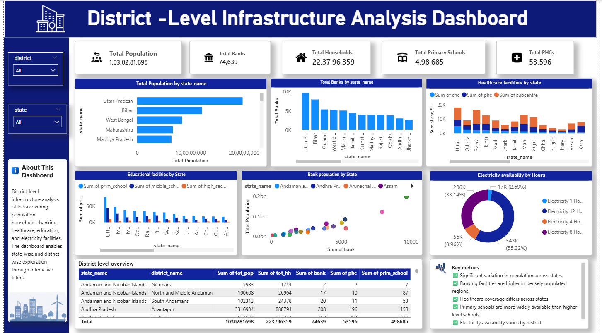

# District-Level Infrastructure Analysis Dashboard | Power BI Project

An interactive Power BI dashboard analyzing population, banking, healthcare, education, and electricity infrastructure across districts in India.

---

## 📌 Overview

This project focuses on analyzing district-level infrastructure development across India using Power BI. The dashboard provides meaningful insights into population distribution, banking accessibility, healthcare facilities, educational institutions, and electricity availability through interactive visualizations.

---

## 🎯 Project Objective

The objective of this project is to transform raw infrastructure data into actionable insights that help understand regional development patterns and public service availability across different states and districts.

---

## 🛠️ Tools Used

- Microsoft Excel (Data Cleaning & Preparation)
- Microsoft Power BI (Data Visualization & Dashboard Development)

---

## 📂 Data Preparation

The dataset was cleaned and prepared using Microsoft Excel:

- Removed missing values
- Corrected data types
- Handled inconsistent records
- Validated column formats
- Prepared a clean dataset for Power BI analysis

---

## 📊 Dashboard Features

### KPI Cards

- 👥 Total Population
- 🏠 Total Households
- 🏦 Total Banks
- 🏥 Total PHCs
- 🎓 Total Primary Schools

### Visualizations

- Population by State (Bar Chart)
- Banking Facilities by State (Column Chart)
- Healthcare Facilities by State (Stacked Column Chart)
- Educational Facilities by State (Clustered Column Chart)
- Electricity Availability (Donut Chart)
- Banks vs Population (Scatter Plot)
- District-Level Infrastructure Overview Table

### Interactive Filters

- State Filter
- District Filter

---

## 🔍 Key Insights

✅ Population distribution varies significantly across states.

✅ Banking facilities are more concentrated in densely populated regions.

✅ Healthcare infrastructure differs across states and districts.

✅ Primary schools are more widely available than middle and high schools.

✅ Electricity availability varies across regions.

✅ Interactive filters enable detailed state-wise and district-wise analysis.

---

## 💡 Skills Demonstrated

- Data Cleaning
- Data Preparation
- Data Visualization
- Dashboard Design
- Business Intelligence
- Microsoft Excel
- Power BI
- Analytical Thinking

---

## 🖼️ Dashboard Preview



---

## 📈 Project Outcome

This project demonstrates the ability to clean, analyze, and visualize large datasets using Excel and Power BI. The dashboard converts raw infrastructure data into meaningful insights through interactive reporting and visual analytics.

---

## 📁 Repository Structure

```text
district-level-infrastructure-analysis-powerbi/
│
├── District_Project.pbix
├── District_Project.png
├── Cleaned_Dataset.xlsx
└── README.md
```

---

## 👨‍💻 Author

**Shiyam T**

### Connect with Me

- LinkedIn: https://www.linkedin.com/in/www.linkedin.com/in/shiyamt1045

- GitHub: https://github.com/https://github.com/shiyam777

---

⭐ If you found this project useful, consider giving it a star.
